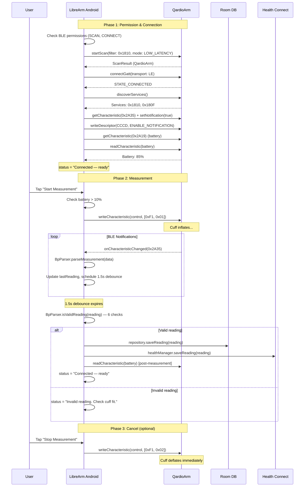
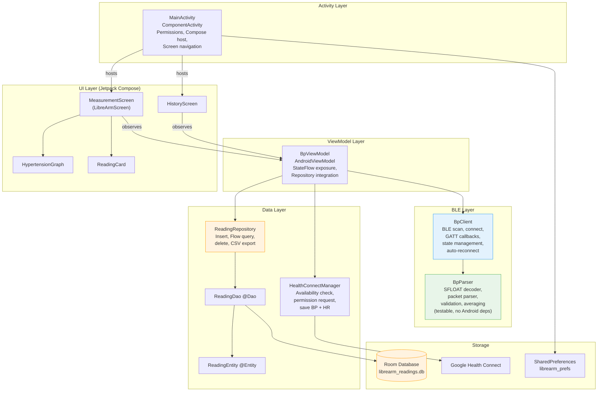
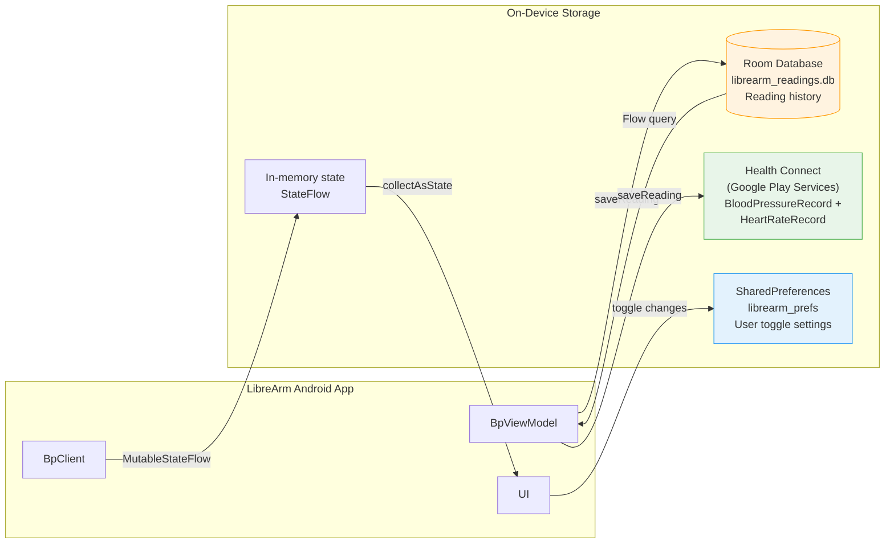
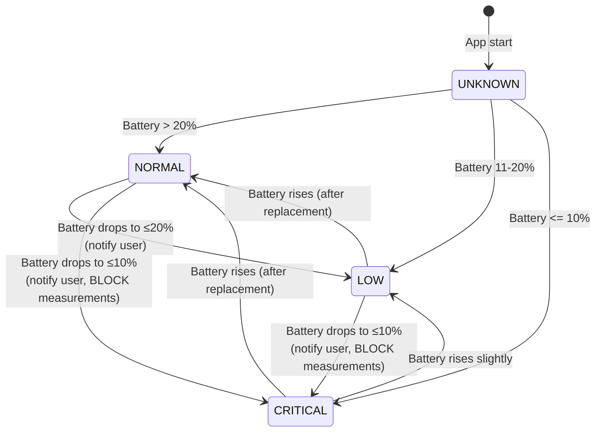
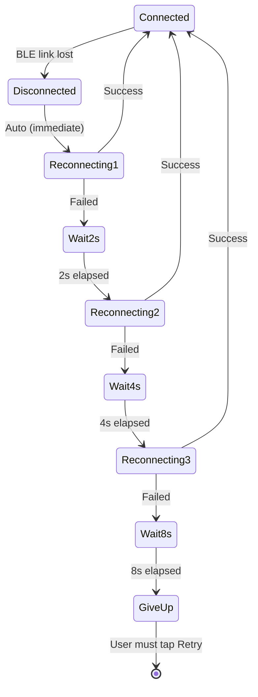
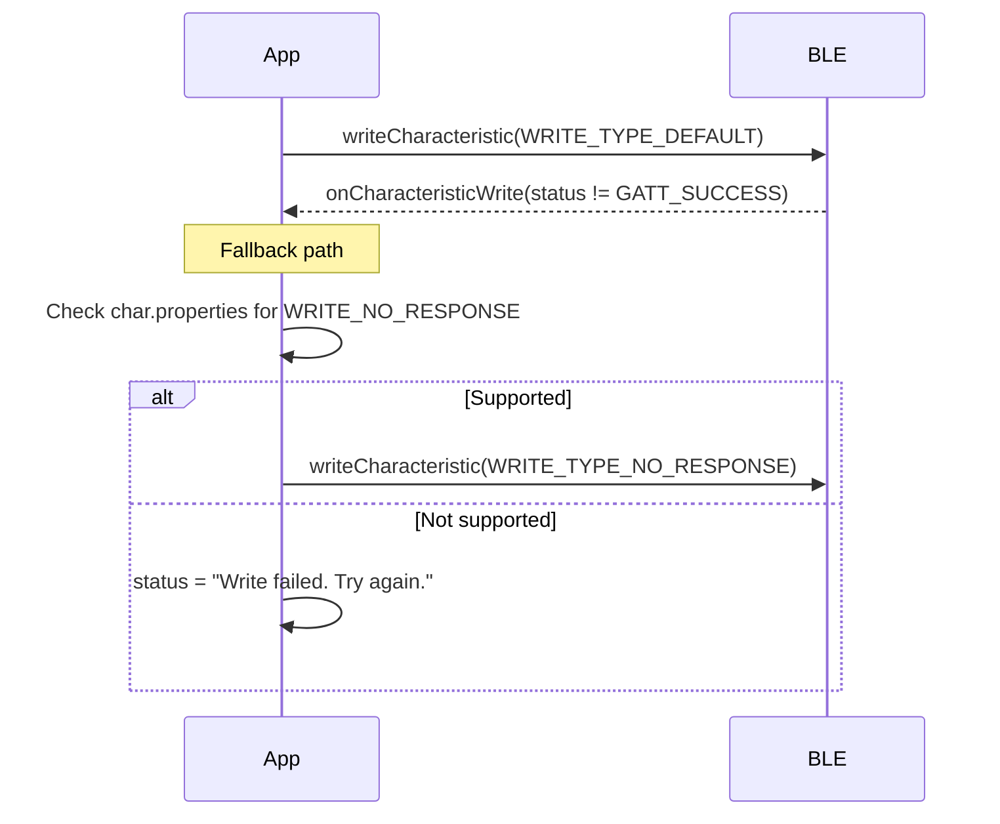

# LibreArm Android — Design Document

| Property | Value |
|----------|-------|
| **Status** | Living Document |
| **Last Updated** | 2026-04-08 |
| **Repository** | [agreenbhm/LibreArm_Android](https://github.com/agreenbhm/LibreArm_Android) (MIT License) |
| **Current Version** | v1.3.0 |
| **License** | MIT |

> This document describes the architecture, BLE protocol, on-device storage, configuration, and proposed future features for the LibreArm Android app. It is intended as a reference for new contributors and to provide context for design decisions.

---

## 1. Why This App Exists

### 1.1 The Qardio Bankruptcy

Qardio, Inc. filed for bankruptcy in 2024 and ceased all operations. Their official QardioApp was removed from the Google Play Store and Apple App Store. Their backend authentication servers were shut down.

Because the QardioApp required server-side authentication on every launch, **every QardioArm blood pressure monitor in the field became non-functional overnight**, despite the hardware being fully operational. The QardioArm has no standalone display — it requires a companion app to:

1. Send start/cancel commands to the cuff pump over Bluetooth
2. Receive and parse blood pressure measurement notifications
3. Display and store the readings

Thousands of users — Tim included — were left with $99-129 of medical-grade hardware they could no longer use.

### 1.2 Why This App Matters

The LibreArm Android app exists to give those users their devices back. It is:

- **Open source** under the MIT license — anyone can audit, fork, or contribute
- **Cloud-free** — no servers, no accounts, no internet required at any point
- **Privacy-preserving** — all data stays on the device or in Google Health Connect
- **Free** — no premium tier, no ads, no in-app purchases
- **Community-maintained** — Drew Green (agreenbhm) ported the iOS app to Android, and contributions from other QardioArm owners (like us) extend it

Security researcher n0ps independently documented zero-day vulnerabilities in the original QardioApp (CISA Advisory ICSMA-25-044-01) including plain-text credential storage and an engineering backdoor that allowed arbitrary hex command execution. **LibreArm avoids all of these by design** — there are no credentials, no servers, and no remote access channels.

---

## 2. QardioArm BLE Communication Protocol

### 2.1 Service & Characteristic Map

The QardioArm advertises a standard Bluetooth SIG Blood Pressure Service combined with a vendor-specific control characteristic:

```mermaid
graph TB
    subgraph QardioArm["QardioArm BLE GATT Server"]
        subgraph BPS["Blood Pressure Service (0x1810) — Standard"]
            BPM["Measurement Char (0x2A35)<br/>Properties: Notify<br/>Format: IEEE 11073 SFLOAT<br/>Sends sys/dia/MAP/HR"]
            CCCD["CCCD Descriptor (0x2902)<br/>Enable/Disable notifications"]
            CTRL["Control Char (vendor-specific)<br/>UUID: 583CB5B3-875D-40ED-<br/>9098-C39EB0C1983D<br/>Properties: Write<br/>Commands: 0xF1,0x01 / 0xF1,0x02"]
        end
        subgraph BAT["Battery Service (0x180F) — Standard"]
            BATLVL["Battery Level (0x2A19)<br/>Properties: Read + Notify<br/>Format: 1 byte (0-100%)"]
        end
    end

    subgraph App["LibreArm Android"]
        GATT["BluetoothGatt<br/>Android BLE API"]
        BPC["BpClient<br/>BLE callbacks + state"]
        BPP["BpParser<br/>SFLOAT + validation"]
        VM["BpViewModel<br/>StateFlow"]
        UI["MainActivity<br/>Compose UI"]
    end

    GATT -->|Scan filter 0x1810| BPS
    BPC -->|writeCharacteristic [0xF1,0x01]| CTRL
    BPM -->|onCharacteristicChanged| BPC
    BPC -->|parseMeasurement| BPP
    BPP -->|BpReading| BPC
    BPC -->|StateFlow.update| VM
    VM -->|collectAsState| UI
    BATLVL -->|readCharacteristic + notify| BPC

    style BAT fill:#fff3e0,stroke:#ff9800
    style BPS fill:#e3f2fd,stroke:#2196f3
    style BPP fill:#e8f5e9,stroke:#4caf50
```

### 2.2 IEEE 11073 SFLOAT Data Format

Blood pressure measurements arrive on characteristic 0x2A35 in the standard Bluetooth SIG Blood Pressure Measurement format:

```
Byte Layout (minimum 7 bytes):
[0]     Flags (bit 0x02 = timestamp present, bit 0x04 = heart rate present)
[1:2]   Systolic (SFLOAT, little-endian)
[3:4]   Diastolic (SFLOAT, little-endian)
[5:6]   MAP (Mean Arterial Pressure, SFLOAT, little-endian)
[7:13]  Optional 7-byte timestamp (if flags & 0x02)
[N:N+1] Optional Heart Rate (SFLOAT, if flags & 0x04)
```

SFLOAT is a 16-bit floating point format defined by IEEE 11073-20601:

```
Bit layout: [EEEE MMMM MMMM MMMM]
  E = 4-bit signed exponent (-8 to +7)
  M = 12-bit signed mantissa (-2048 to +2047)
  value = mantissa × 10^exponent

Special reserved values:
  0x07FF = NaN
  0x0800 = NRes (Not at this Resolution)
  0x07FE = +INFINITY
  0x0802 = -INFINITY
```

### 2.3 Measurement Sequence



### 2.4 Reading Validation (6 Rules)

| # | Rule | Range/Check | Why |
|---|------|-------------|-----|
| 1 | Diastolic > 0 | Required | Filters partial/intermediate BLE notifications |
| 2 | Values finite | Required | Filters SFLOAT NaN (0x07FF) and Infinity |
| 3 | Systolic in 60-260 mmHg | Range | Physiological limits |
| 4 | Diastolic in 40-160 mmHg | Range | Physiological limits |
| 5 | Systolic > Diastolic | Required | Cardiovascular physiology |
| 6 | Pulse pressure ≤ 120 mmHg | Required | Filters measurement errors |

### 2.5 Available Device Capabilities

| Capability | BLE Access | App Support |
|-----------|------------|------------|
| Blood pressure measurement (sys/dia) | Write start, read 0x2A35 notifications | **Yes** |
| Mean Arterial Pressure (MAP) | Bytes 5-6 of 0x2A35 | **Yes** |
| Heart rate / pulse | Optional bytes in 0x2A35 (flags & 0x04) | **Yes** |
| Start/cancel measurement | Write [0xF1,0x01] / [0xF1,0x02] to control char | **Yes** |
| Battery level monitoring | Read/notify 0x2A19 on service 0x180F | **Yes (PR #5)** |
| Irregular heartbeat detection | Possibly bit 3 of flags byte (BT SIG spec) | Not yet implemented |
| Device timestamp | Optional 7-byte field in 0x2A35 | Parsed but not displayed |
| Firmware version | Possibly via Device Information Service (0x180A) | Not explored |

---

## 3. Application Architecture

### 3.1 Component Architecture (Post-PR State)



### 3.2 Source File Inventory (Post-PR State)

```
app/src/main/java/com/ptylr/librearm/
├── MainActivity.kt                     # Activity, permissions, Compose host, navigation
├── BpViewModel.kt                      # ViewModel + repository integration
├── ble/
│   ├── BpClient.kt                    # BLE scan, GATT, battery, reconnect, error fallback
│   └── BpParser.kt                    # SFLOAT, packet parsing, validation, averaging (NEW)
├── data/                              # Room database (NEW package)
│   ├── ReadingEntity.kt               # @Entity
│   ├── ReadingDao.kt                  # @Dao
│   ├── AppDatabase.kt                 # @Database singleton
│   └── ReadingRepository.kt           # Repository + CSV export
├── model/
│   ├── BpModels.kt                    # BpState, BpReading, MeasurementMode + battery fields
│   └── BpClassification.kt            # AHA category enum + classifyReading() (NEW)
├── health/
│   └── HealthConnectManager.kt        # Health Connect availability + save
├── ui/
│   ├── graph/
│   │   └── HypertensionGraphView.kt   # Compose Canvas BP zones (NEW)
│   ├── history/
│   │   └── HistoryScreen.kt           # LazyColumn + delete + share (NEW)
│   └── theme/
│       ├── Theme.kt
│       ├── Color.kt
│       ├── Type.kt
│       └── Shape.kt

app/src/test/java/com/ptylr/librearm/   # Unit tests (NEW)
├── ble/
│   ├── SfloatParserTest.kt            # 12 tests
│   ├── ReadingValidationTest.kt       # 21 tests
│   ├── MeasurementParserTest.kt       # 7 tests
│   └── AveragingTest.kt               # 9 tests
└── model/
    └── BpClassificationTest.kt        # AHA category tests
```

### 3.3 Build Configuration

| Setting | Value |
|---------|-------|
| Min SDK | 26 (Android 8.0) |
| Target SDK | 34 (Android 14) |
| Compile SDK | 34 |
| Kotlin | 1.9.22 |
| Compose BOM | 2024.02.00 |
| Compose Compiler | 1.5.8 |
| JVM Target | 17 |
| AGP | 8.13.2 |
| Health Connect | 1.1.0-alpha06 |
| **Room** | **2.6.1 (NEW — added in PR #8)** |
| **KSP** | **1.9.22-1.0.17 (NEW — added in PR #8)** |
| **JUnit** | **4.13.2 (NEW — added in PR #4)** |

---

## 4. On-Device Storage

### 4.1 Storage Locations Overview

The Android app stores three categories of data, all on-device. Nothing is sent to any remote server.



### 4.2 Room Database (Local Persistence)

**Database file**: `librearm_readings.db` in the app's private storage (`/data/data/com.ptylr.librearm/databases/`).

**Schema**:

```kotlin
@Entity(tableName = "readings")
data class ReadingEntity(
    @PrimaryKey(autoGenerate = true) val id: Long = 0,
    val systolic: Double,
    val diastolic: Double,
    val meanArterialPressure: Double?,
    val heartRate: Double?,
    val timestamp: Long,        // epoch millis
    val mode: String,           // "single" or "average3"
    val savedToHealth: Boolean = false
)
```

**DAO operations**:
- `insert(reading)` — Add a new reading after successful measurement
- `getAllReadings(): Flow<List<ReadingEntity>>` — Reactive list, sorted by timestamp DESC
- `getReadingsInRange(start, end): Flow<List<ReadingEntity>>` — Date-range query for trends
- `delete(reading)` — Swipe-to-delete from history screen
- `getCount(): Int` — For badge/empty-state checks

**Lifecycle**: The database is a singleton initialized in `AppDatabase.getInstance(context)`. The app uses Room's built-in migration support; the initial schema is version 1.

**Privacy**: The database is in the app's private storage, not accessible to other apps without root. It's included in the standard Android backup mechanism, but contains only blood pressure measurements (no PII unless the user adds notes in a future feature).

### 4.3 Health Connect (System Hub)

**What gets written**:

```kotlin
val bpRecord = BloodPressureRecord(
    time = instant,
    zoneOffset = zoneOffset,
    systolic = Pressure.millimetersOfMercury(reading.sys),
    diastolic = Pressure.millimetersOfMercury(reading.dia)
)

val hrRecord = HeartRateRecord(
    startTime = instant,
    endTime = instant,
    zoneOffset = zoneOffset,
    samples = listOf(HeartRateRecord.Sample(time = instant, beatsPerMinute = bpm.roundToInt().toLong()))
)
```

**Permissions required**:
- `android.permission.health.WRITE_BLOOD_PRESSURE`
- `android.permission.health.WRITE_HEART_RATE`

**Range constraints (Health Connect API)**:
- Systolic: 40-200 mmHg (Health Connect's stricter limit)
- Diastolic: 20-130 mmHg
- HR: 20-220 bpm

These are stricter than the device's BLE validation rules (60-260 / 40-160), so HealthConnectManager has its own `isWithinSupportedRange()` check before calling `client.insertRecords()`.

**Why Health Connect**: It serves as the integration hub for Android. Any app that reads BP from Health Connect (Samsung Health, Fitbit, third-party trackers) automatically gets LibreArm's data without LibreArm needing custom integrations.

### 4.4 SharedPreferences (User Settings)

**File name**: `librearm_prefs` (MODE_PRIVATE)

| Key | Type | Default | Purpose |
|-----|------|---------|---------|
| `pref_auto_health` | Boolean | `false` | Whether to auto-save readings to Health Connect |
| `pref_average_three` | Boolean | `false` | Whether average-of-3 measurement mode is enabled |

**Why SharedPreferences instead of DataStore**: The original Android app uses SharedPreferences and we matched the existing convention. Future PRs could migrate to DataStore for type safety, but it's not a current priority.

### 4.5 In-Memory State (Runtime Only)

**`MutableStateFlow<BpState>`** in `BpClient` — current measurement state, last reading, battery level, connection status. Lost on process death; the next launch reconnects fresh.

```kotlin
data class BpState(
    val status: String = "Searching for device…",
    val lastReading: BpReading? = null,
    val isConnected: Boolean = false,
    val canMeasure: Boolean = false,
    val isMeasuring: Boolean = false,
    val measurementMode: MeasurementMode = MeasurementMode.SINGLE,
    val delayBetweenRunsSeconds: Int = 15,
    val batteryLevel: Int? = null,
    val batteryStatusLine: String = "Battery: unavailable"
)
```

---

## 5. Configuration

### 5.1 User-Facing Configuration

All user settings are simple toggles or sliders in the main UI. No settings screen needed at this scale.

| Setting | UI Control | Storage | Values |
|---------|-----------|---------|--------|
| Save to Health Connect | Switch | SharedPreferences | true/false |
| Average mode (3 readings) | Switch | SharedPreferences | SINGLE / AVERAGE3 |
| Delay between average readings | Slider | StateFlow (in-memory) | 15s / 30s / 45s / 60s |
| Health Connect permissions | System dialog | Health Connect | granted/denied |
| Bluetooth permissions | System dialog | Android system | granted/denied |
| Notification permissions | System dialog | Android system | granted/denied |

### 5.2 Build-Time Configuration (build.gradle.kts)

| Setting | Current Value | Notes |
|---------|--------------|-------|
| `applicationId` | `com.ptylr.librearm` | Original — would change if forking |
| `versionCode` | `1` | Incremented on release |
| `versionName` | `1.3.0` | Will be `1.4.0` post-PRs |
| `minSdk` | `26` | Android 8.0+ |
| `targetSdk` | `34` | Android 14 |
| `compileSdk` | `34` | |
| Signing | Shared debug keystore | TODO: Production signing for Play Store release |
| Minify (release) | `false` | TODO: Enable R8 + ProGuard rules |

### 5.3 Compile-Time Constants

Hard-coded constants in `BpClient.kt`:

```kotlin
private val bpsService = UUID.fromString("00001810-0000-1000-8000-00805f9b34fb")
private val measurement = UUID.fromString("00002a35-0000-1000-8000-00805f9b34fb")
private val control = UUID.fromString("583CB5B3-875D-40ED-9098-C39EB0C1983D")
private val batteryService = UUID.fromString("0000180f-0000-1000-8000-00805f9b34fb")
private val batteryLevel = UUID.fromString("00002a19-0000-1000-8000-00805f9b34fb")

private val startCommand = byteArrayOf(0xF1.toByte(), 0x01)
private val cancelCommand = byteArrayOf(0xF1.toByte(), 0x02)

private val completionDebounceSeconds = 1.5
private val maxReconnectAttempts = 3
```

### 5.4 Permissions (AndroidManifest.xml)

```xml
<uses-permission android:name="android.permission.BLUETOOTH" android:maxSdkVersion="30" />
<uses-permission android:name="android.permission.BLUETOOTH_ADMIN" android:maxSdkVersion="30" />
<uses-permission android:name="android.permission.ACCESS_FINE_LOCATION" />
<uses-permission android:name="android.permission.BLUETOOTH_SCAN" />
<uses-permission android:name="android.permission.BLUETOOTH_CONNECT" />
<uses-permission android:name="android.permission.ACTIVITY_RECOGNITION" />
<uses-permission android:name="android.permission.health.WRITE_BLOOD_PRESSURE" />
<uses-permission android:name="android.permission.health.WRITE_HEART_RATE" />
```

---

## 6. Currently Implemented Features

### 6.1 Already in Upstream v1.3.0

| Feature | Implementation |
|---------|---------------|
| BLE scan + connect to QardioArm | `BpClient.startConnect()` with 30s timeout |
| Single measurement mode | `BpClient.startMeasurement()` writes [0xF1,0x01] |
| Average-of-3 measurement mode | `remainingRuns` counter + countdown delay |
| Configurable delay (15/30/45/60s) | Slider with snap-to-grid |
| BLE measurement parsing (SFLOAT) | Inline `sfloat()` function in `BpClient.parseMeasurement` |
| Basic plausibility check | `isPlausible()` — sys/dia range only |
| 1.5s debounce after last notification | `scheduleFinalize()` coroutine |
| Display last reading (sys/dia/MAP/HR) | Compose Card with icons |
| Health Connect integration | `HealthConnectManager` |
| Settings persistence | SharedPreferences |
| Keep screen on during measurement | `KeepScreenOn` composable + `WindowManager` flag |
| Permission flow (BLE + Health Connect) | `ActivityResultContracts` |

### 6.2 Implemented in Open PRs (Awaiting Review)

| # | PR | Feature | Status |
|---|-----|---------|--------|
| #3 | [Strict reading validation](https://github.com/agreenbhm/LibreArm_Android/pull/3) | All 6 iOS validation rules | Open |
| #4 | [Unit tests + SFLOAT bug fix](https://github.com/agreenbhm/LibreArm_Android/pull/4) | 49 JUnit tests + parser refactor + production bug fixes | Open |
| #5 | [Battery monitoring](https://github.com/agreenbhm/LibreArm_Android/pull/5) | iOS v1.4.0 parity: discovery, display, warnings, critical block | Open |
| #6 | [Hypertension graph](https://github.com/agreenbhm/LibreArm_Android/pull/6) | Compose Canvas with 5 AHA zones | Open |
| #7 | [Error handling](https://github.com/agreenbhm/LibreArm_Android/pull/7) | Write fallback + auto-reconnect 3x exponential backoff | Open |
| #8 | [Local history](https://github.com/agreenbhm/LibreArm_Android/pull/8) | Room database + History screen + CSV export | Open |

### 6.3 Implementation Details: New Features

#### 6.3.1 Battery Monitoring (PR #5)

**State machine**:



State transitions only fire notifications on **degradation** (NORMAL→LOW, LOW→CRITICAL, NORMAL→CRITICAL). This prevents notification spam if the battery reads slightly high after a fresh measurement.

#### 6.3.2 Hypertension Graph (PR #6)

5 zones drawn on a Compose Canvas (240dp tall, full width):

| Zone | Color | Criteria | Drawing |
|------|-------|----------|---------|
| Stage 2 (Red) | `#FB5959` | sys ≥ 160 OR dia ≥ 100 | Full background |
| Stage 1 (Pink) | `#FB80A6` | sys 140-159 OR dia 90-99 | L-shaped overlay |
| Prehypertension (Orange) | `#F2A659` | sys 120-139 OR dia 80-89 | L-shaped overlay |
| Normal (Green) | `#73D973` | sys 90-119 AND dia 60-79 | Inner box |
| Low (Cyan) | `#80D9D9` | sys < 90 AND dia < 60 | Bottom-left box |

Plot point: 18dp circle, black fill, white stroke, drop shadow.

#### 6.3.3 Local History (PR #8)

Screen layout:

```
┌─────────────────────────────────┐
│  ← Reading History         ⤴   │ ← TopAppBar with back + share
├─────────────────────────────────┤
│  Today                          │ ← Section header
│  ●  138/88 mmHg     14:23  🗑  │ ← Pink dot (Stage 1) + delete
│  ●  124/79 mmHg     09:15  🗑  │ ← Orange dot (Pre)
│                                 │
│  Yesterday                      │
│  ●  118/76 mmHg (avg) 18:42  🗑│ ← Green dot (Normal) + avg badge
│                                 │
│  April 6, 2026                  │
│  ●  142/91 mmHg     07:30  🗑  │
└─────────────────────────────────┘
```

CSV export format:
```
Date,Time,Systolic,Diastolic,MAP,HeartRate,Mode
2026-04-08,14:23:15,138,88,105,72,single
2026-04-08,09:15:42,124,79,94,68,single
```

#### 6.3.4 Error Handling (PR #7)

Reconnection state machine:



Write error fallback:


#### 6.3.5 Unit Tests (PR #4)

49 tests across 4 suites, all running on pure JVM with no Android SDK or emulator required:

| Suite | Tests | Coverage |
|-------|-------|----------|
| `SfloatParserTest` | 12 | Zero, normal values, positive/negative exponent, NaN, NRes, +/-INF, negative mantissa |
| `ReadingValidationTest` | 21 | All 6 validation rules + boundary values + edge cases |
| `MeasurementParserTest` | 7 | BLE packet parsing (minimal, with HR, with timestamp, partial inflation, too short) |
| `AveragingTest` | 9 | Averaging valid/invalid mix, empty list, MAP NaN filter, HR range filter |

**Bugs caught**: While writing the tests, two real bugs in the production SFLOAT parser were discovered and fixed:
1. Exponent was not sign-extended (would silently break for fractional values)
2. Special value detection was overly broad (would flag normal large mantissas as NaN)

Refactored `BpClient.parseMeasurement` to delegate to the now-tested `BpParser.parseMeasurement` so there's a single source of truth.

---

## 7. Proposed Future Features (Not Yet Implemented)

### 7.1 Measurement Reminders

**Need**: Consistent BP monitoring requires regular measurements. AHA recommends multiple readings per day at consistent times. Withings, Omron, iHealth, and the original QardioApp all have this.

**Proposed design**:
- `AlarmManager` + `NotificationChannel` for daily reminders
- User picks one or more times of day
- Notification taps open the app to the measurement screen
- Persisted in SharedPreferences

### 7.2 Notes per Reading

**Need**: Context matters. Was the reading taken after exercise? In the morning? While stressed? Omron, iHealth, and Withings all support free-form notes.

**Proposed design**:
- Add `notes: String?` column to `ReadingEntity` (Room migration v2)
- Optional dialog after reading completion: "Add a note? (skip / save)"
- History screen displays notes inline below the reading
- CSV export includes notes column

### 7.3 Trend Charts

**Need**: Users want to see BP trends over weeks and months, not just the last reading.

**Proposed design**:
- New `TrendsScreen.kt` composable
- 7-day and 30-day line charts (Compose Canvas)
- Shows systolic, diastolic, and HR overlays
- Min/max/average summary statistics per period
- Date-range picker for custom ranges
- Data sourced from `repository.getReadingsInRange()`

### 7.4 PDF Doctor Reports

**Need**: Doctors prefer formatted PDF reports over CSV. Omron offers customizable PDF reports as a premium feature.

**Proposed design**:
- Use Android's built-in PDF generation (`PdfDocument`)
- Report includes: patient info (optional), date range, summary statistics, list of readings, hypertension classification breakdown
- Share via Intent.ACTION_SEND with `application/pdf` MIME type

### 7.5 Multi-User Profiles

**Need**: Families share QardioArm devices. Withings supports 8 profiles, Omron supports unlimited.

**Proposed design**:
- Add `profileId: String` and `profileName: String` columns to `ReadingEntity` (Room migration v3)
- Profile picker at top of screen
- Independent history per profile
- Settings stored per profile
- "Add profile" dialog with name input

### 7.6 Irregular Heartbeat Detection

**Need**: The original QardioApp detected irregular heartbeats. Bluetooth SIG specifies bit 3 of the flags byte for "Irregular Pulse Detection". Need to investigate whether the QardioArm sets this flag.

**Proposed design**:
- In `BpParser.parseMeasurement`, check `flags and 0x08 != 0`
- Add `irregularHeartbeat: Boolean` to `BpReading` and `ReadingEntity`
- Display warning icon next to the heart rate when set
- Include in CSV export

### 7.7 Measurement Tags / Lifestyle Context

**Need**: Beyond free-form notes, structured tags enable filtering and analysis. Omron offers preset tags (after exercise, stressed, after meal, etc.).

**Proposed design**:
- Predefined tag set: "Morning", "Evening", "After exercise", "After meal", "Resting", "Stressed", "After medication"
- Multi-select chips after each measurement
- Filter history by tag
- Trend analysis: "Your readings after exercise average X/Y"

### 7.8 LLM-Ready Data Export

**Need**: MedM pioneered exporting BP data in a format ready for LLMs (ChatGPT, Claude, Gemini) so users can ask questions about their trends. Emerging differentiator.

**Proposed design**:
- Export endpoint that produces a Markdown summary with structured data
- "Share with AI" button that copies to clipboard
- Includes hypertension classification, trends, key statistics
- No external API calls — user pastes into their preferred LLM

### 7.9 FHIR R4 Export

**Need**: First-mover opportunity. No consumer BP app currently exports FHIR. Would enable direct import into Electronic Health Records.

**Proposed design**:
- Generate `Observation` resources per reading following the FHIR Vital Signs profile
- LOINC codes: 8480-6 (systolic), 8462-4 (diastolic), 8867-4 (heart rate)
- Bundle multiple readings as a `Bundle` resource
- Export as JSON file via Share intent

### 7.10 Wear OS Companion

**Need**: Quick measurement initiation from a smartwatch. Limited platform APIs prevent the watch from doing the actual BP measurement, but it can trigger the phone to start.

**Proposed design**:
- Wear OS app that exposes a "Take Measurement" tile
- Communicates with the phone via `Wearable.MessageApi`
- Phone-side service wakes the app and starts a measurement
- Watch displays the result when complete

---

## 8. Risks and Mitigations

| Risk | Impact | Mitigation |
|------|--------|------------|
| Drew rejects PRs or stops responding | Medium | Plan B is to fork, but Drew has been responsive (replied within hours of initial outreach) |
| Android BLE behavior varies across manufacturers | High | PR #7 adds write fallback + auto-reconnect; will validate with users when published |
| Health Connect alpha API changes | Medium | Update to stable release; abstract behind `HealthConnectManager` for easy migration |
| Room migration breakage on schema changes | Low | Use `fallbackToDestructiveMigration` in dev, proper migrations for releases |
| Play Store rejection as "medical device" | Medium | Position as "wellness logging" — same approach as LibreArm iOS got past Apple |
| QardioArm 2 has different protocol | Low | Out of scope for v1; would be a separate effort |

---

## 9. References

### Project links
- [agreenbhm/LibreArm_Android (upstream)](https://github.com/agreenbhm/LibreArm_Android)
- [Spockinnator/LibreArm_Android (our fork)](https://github.com/Spockinnator/LibreArm_Android)
- [Outreach issue #2](https://github.com/agreenbhm/LibreArm_Android/issues/2)

### Open PRs
- [PR #3 — Strict validation](https://github.com/agreenbhm/LibreArm_Android/pull/3)
- [PR #4 — Unit tests + SFLOAT bug fix](https://github.com/agreenbhm/LibreArm_Android/pull/4)
- [PR #5 — Battery monitoring](https://github.com/agreenbhm/LibreArm_Android/pull/5)
- [PR #6 — Hypertension graph](https://github.com/agreenbhm/LibreArm_Android/pull/6)
- [PR #7 — Error handling](https://github.com/agreenbhm/LibreArm_Android/pull/7)
- [PR #8 — Local history](https://github.com/agreenbhm/LibreArm_Android/pull/8)

### Technical
- [Bluetooth SIG Blood Pressure Profile 1.1.1](https://www.bluetooth.com/specifications/specs/blood-pressure-profile-1-1-1/)
- [IEEE 11073-10407 BP Monitor Standard](https://standards.ieee.org/standard/11073-10407-2020.html)
- [CISA Advisory ICSMA-25-044-01](https://www.cisa.gov/news-events/ics-medical-advisories/icsma-25-044-01)
- [Reversing the QardioArm — n0ps](https://n0psn0ps.github.io/2025/02/13/Reversing-the-QardioArm/)
- [LibreArm Blog Post (ptylr.com)](https://ptylr.com/posts/2025-09-28-librearm-breathing-new-life-into-qardioarm-devices)
- [Google Health Connect Documentation](https://developer.android.com/health-and-fitness/guides/health-connect)
